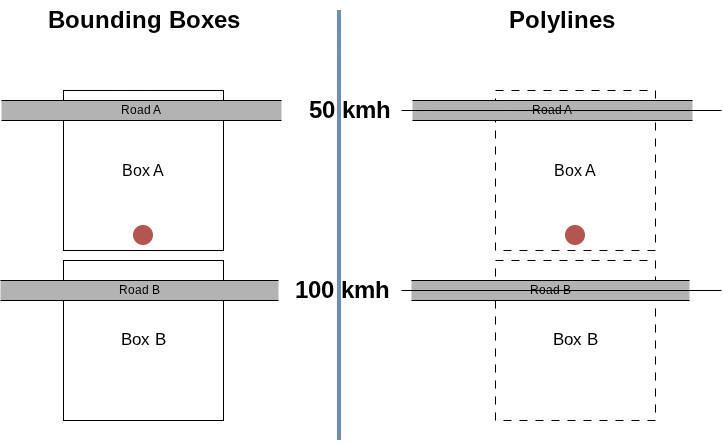

# Bounding boxes and Polylines
Almost everything works with "bounding boxes" in OSM. Roads are actually "polylines". So far, a road was chosen based on the gps position towards the center of the nearest bounding box, but:

* Bounding boxes (can) overlap heavily.
* Their centers are not on the road.
* Their centers can be closer to the wrong road. 

Especially with parallel roads, like a main road and service road next to it, this can occur.
See below image.  

 
The red dot is our GPS position. Due to GPS inaccuracy and inaccuracy in road mapping in OSM (and other systems), it is not always exactly on the road we are driving on. In this case we are driving on road B.  
Both left and right represent the same situation. On the left you see the **Bounding box only** example. On the right you see the **Google encoded polyline** example.

* Our GPS position is closer to road B than to road A.
* At the same time, our GPS position is closer to the center of Box A, than it is to the center of box B.

In this **Bounding Box only** example on the left, the app will select the road closest to the center of bounding box A, which is road A. This is the **wrong** road thereby displaying an incorrect speed limit of 50 kmh.  
On the right you see a **Google encoded polyline** example. The bounding boxes are still there as a basic framework, but now also the nearest distance to a polyline (line based representation of a higway, here on top of the highway) is done. Now the **correct** road is selected, displaying the correct speed limit of 100 kmh.  
As of version 2.2 the app uses databases including polylines. It means that going from a version older than 2.2, you **must** also update your databases.