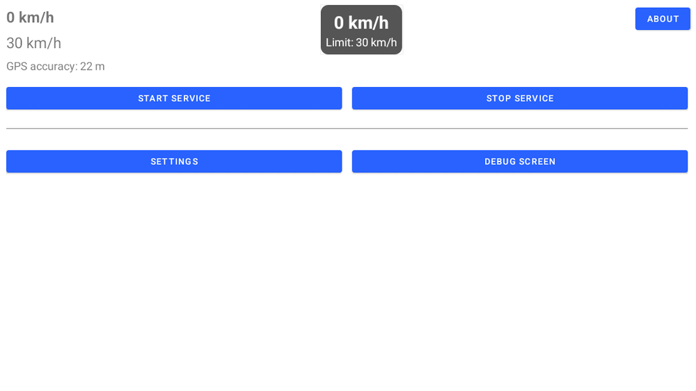

# Speed Alert
<br>
<!--  -->
A simple tool that shows an overlay with your current speed and the speed limit for that road (when a limit is available for that road). The overlay text switches to red when overspeeding and plays an alarm sound if you exceed the speed tolerance you defined. The overlay can be dragged anywhere on screen. Next to that: if you lose GPS, it will tell you "no GPS".<br>
This app uses your GPS to get exact location and speed and then uses the [Overpass Api](https://wiki.openstreetmap.org/wiki/Overpass_API) from the [OpenStreetMap](https://openstreetmap.org) database to get speed limits for the relevant part of the road you are driving on. Note that this app will only work if the GPS location is accurate and the road has assigned speed limits in the [OpenStreetMap](https://openstreetmap.org) database, but it will work world-wide as long as the street has an assigned speed limit.<br>
This app is 80% made with AI (MS CoPilot) and 20% by "me, myself and I".<br><br>

### Note: You use this app entirely at your own risk. I am not responsible for incorrect functioning or incorrect use of the app. All responsibility for use, or incorrect use, lies entirely with you! Always follow the specified (temporary) speed limits and drive responsibly.

**This app does not collect, store or share any personal information. It is 100% privacy friendly.**

## Requirements
Working GPS and working network connection to retrieve the online speed limit data. It doesn't matter whether you have a hot-spot via your phone or a SIM in your unit, just as long as you have a working internet connection.

## Required permissions
 - Background location - The app (Android) will ask: "Allow all the time", "Allow only when using the app", "Ask every time", "Deny". You need to select "Allow all the time", as the app needs to be able to run in the background. This means it can use background location as long as the app runs (not as long as your system runs).
 - Overlay permission
 - Notification permission
 - Ignore Battery optimization (especially on Android 14/15/16)

## Screenshots
**All screenshots are in below animated gif.** The app is still heavily in development, so screenshots may differ from the ones shown here. Note: The app screen automatically follows the system day-night mode. Some (partial) screenshots are therefore "dark" or "light".
<br><br>
<br><br>

## App info and explanation
The app uses a "foreground service". A foreground service is an Android service that keeps running by showing a persistent notification so the system treats it as important and doesn’t kill it, even when not visible.<br>
As this is a debug/test app, you need to start the foreground service manually. You can stop and (re)start it wwhenever you want.<br>
It will show an overlay (when you enabled it).<br>
Again: Note that this apk will only work if the GPS location is accurate and the road has assigned speed limits in the [OpenStreetMap](https://openstreetmap.org) database.</p>
Buttons that might need an explanation *(and note: everything below the horizontal line shouldn't be necessary for you as end user and will disappear in later versions)*:
<ul><li>Start and Stop - Explained above.</li>
<li>Settings - Here you define your preferences: overspeed tolerance, mph or kmh, start service on startup of SpeedAlert app, etcetera.</li>
<li>Debug screen - It shows you what is happening in the background. This will be written to a log file. If the app works as it should, you never need this screen. Otherwise post me the info by using: "Copy log" -> compy onto your unit, "Share log" -> is any share option your unit supports. As the logfile can grow substantially you can also "empty" it. The "in memory" log will be kept below 50Kb (400-600 lines).</li>
</ul>


## Installation
Just download it from [Github](https://github.com/hvdwolf/SpeedAlert/releases/latest) and then side-load the application from your file manager.<br>(Note: When Google asks you to scan the app, then do so. My app is signed and should be absolutely secure and OK, but we live in dangerous times).<br>

## Releases
The releases are done via [my github](https://github.com/hvdwolf/SpeedAlert/releases/latest).<br>
The app should run on Android 10 to 14, but I only tested on my DuDu7 running Android 13/SDK33.<br>
*(Technically it should also run on mtcd/mtce type units, all fyt units, all QCM6125/QCM6490 (Joying) units and TS10/TS18 units, as of Android 10+)*

## Translations
I used MS CoPilot to do an automatic translation of the strings. The default language is (US) English. Other abbreviated languages are (so far): us, de, es, fr, it, nl, pl, ru, uk.<br>
If you want to have it in your own language, you need to download the [strings.xml](https://github.com/hvdwolf/SpeedAlert/raw/main/app/src/main/res/values/strings.xml), and translate it (note the multi-line disclaimer and the dialog_fyt_message) and send it back to me. A good advice might be to select and copy the entire text and tell chatgpt, ms copilot, gemini or whatever AI tool to "translate the following strings.xml to *my language*"  and then copy the text behind it. It saves you a lot of typing. Only some correcting if necessary.<br>
If you think your language is badly translated, download the strings.xml from your country folder [values-xx](https://github.com/hvdwolf/SpeedAlert/raw/main/app/src/main/res/) and improve the translation, and in case of unclear translations, also download the US English version to compare. _(I think it did a pretty nice job for my own Dutch language. I only needed to change 1 string)_

<HR>

Copyleft 2026 Harry van der Wolf (surfer63), MIT License.<br>

## MIT License
Permission is hereby granted, free of charge, to any person obtaining a copy
of this software and associated documentation files (the "Software"), to deal
in the Software without restriction, including without limitation the rights
to use, copy, modify, merge, publish, distribute, sublicense, and/or sell
copies of the Software, and to permit persons to whom the Software is
furnished to do so, subject to the following conditions:

The above copyright notice and this permission notice shall be included in all
copies or substantial portions of the Software.

THE SOFTWARE IS PROVIDED "AS IS", WITHOUT WARRANTY OF ANY KIND, EXPRESS OR
IMPLIED, INCLUDING BUT NOT LIMITED TO THE WARRANTIES OF MERCHANTABILITY,
FITNESS FOR A PARTICULAR PURPOSE AND NONINFRINGEMENT. IN NO EVENT SHALL THE
AUTHORS OR COPYRIGHT HOLDERS BE LIABLE FOR ANY CLAIM, DAMAGES OR OTHER
LIABILITY, WHETHER IN AN ACTION OF CONTRACT, TORT OR OTHERWISE, ARISING FROM,
OUT OF OR IN CONNECTION WITH THE SOFTWARE OR THE USE OR OTHER DEALINGS IN THE
SOFTWARE.
```
