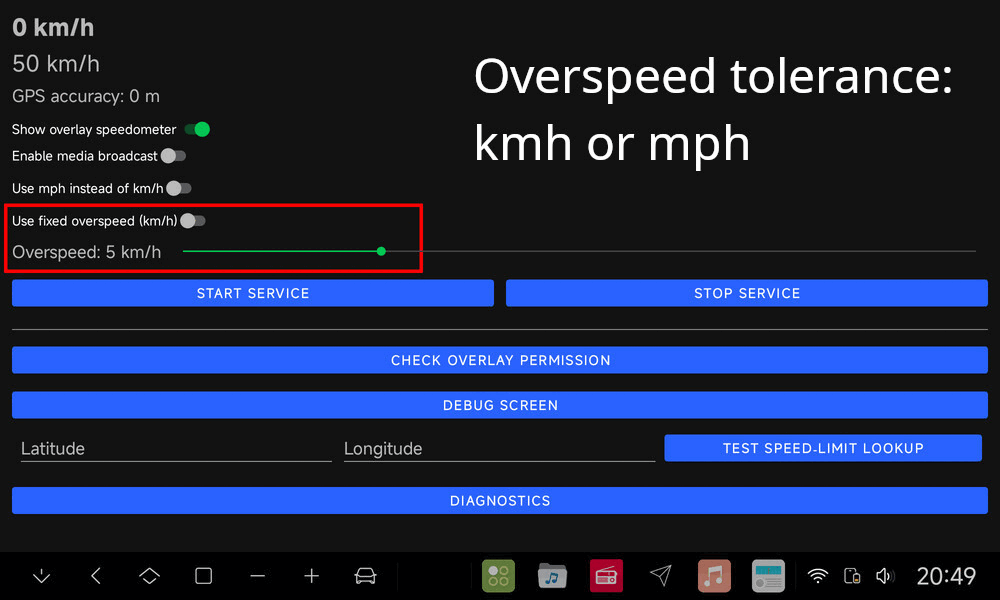

# Speed Alert
<br>
<!--  -->
A simple tool that shows an overlay with your current speed and the speed limit for that road (when a limit is available for that road). The overlay text switches to red when overspeeding and plays an alarm sound. Next to that: if you lose GPS, it will tell you "no GPS".<br>
This app uses your GPS to get exact location and speed and then uses the [Overpass Api](https://wiki.openstreetmap.org/wiki/Overpass_API) from the [OpenStreetMap](https://openstreetmap.org) database to get speed limits for the relevant part of the road you are driving on. Note that this app will only work if the GPS location is accurate and the road has assigned speed limits in the [OpenStreetMap](https://openstreetmap.org) database, but it will work world-wide as long as the street has an assigned speed limit.<br>
Currently it is only in km/h, but a conversion to mph/h can easily be added.<br>
This app is 80% made with AI (MS CoPilot) and 20% by "me, myself and I".<br><br>
*It is meant as an example App for use on FYT units, but can theoretically be used on any Android head unit running real Android 10+. It has a lot of debug options as FYT and other head units use "crippled" Android versions. If you can use this app in your own app (a modified launcher or whatever), please do so. I hope it will be implemented (and improved) inside the Dudu 7/6/5/4/3 units (as I do have a dudu7).*<br>
### Note: You use this app entirely at your own risk. I am not responsible for incorrect functioning or incorrect use of the app. All responsibility for use, or incorrect use, lies entirely with you! Always follow the specified (temporary) speed limits and drive responsibly.

## Requirements
Working GPS and working netwrok connection to retrieve the online speed limit data. It doesn't matter whether you have a hot-spot via you phone or a SIM in you unit, just as long as you have a working internet connection.

## App Permissions
<ul><li>It needs ACCESS_FINE_LOCATION and ACCESS_COARSE_LOCATION to get access to your exact location (during use of the App). Otherwise it can't check your location and if you are overspeeding or not.</li>
<li>It needs ACTION_MANAGE_OVERLAY_PERMISSION when using an overlay.</li>
</ul><br>

**This app does not collect, store or share any personal information. It is 100% privacy friendly.**

## Screenshots
*(Note: The screen automatically follows the system day-night mode. Here you see day light mode.)*<br>
In the below animated gif (resized to 50%) you see: 1) main screen; 2) main screen with service started (top right); 3) Driving 72 km/h on an 80 km/h road; 4) Overspeeding on an 80 km/h road; 5) A road without assigned speed limit.<br>*Off course yo do not hear the "beep-beep-beep" in the "overspeeding" screenshot*  ;)
<br><br>
<br>


## App info and explanation
The app uses a "foreground service". A foreground service is an Android service that keeps running by showing a persistent notification so the system treats it as important and doesn’t kill it, even when not visible.<br>
As this is a debug/test app, you need to start the foreground service manually. You can stop and (re)start it wwhenever you want.<br>
It will show an overlay (when you enabled it).<br>
Again: Note that this apk will only work if the GPS location is accurate and the road has assigned speed limits in the [OpenStreetMap](https://openstreetmap.org) database.</p>
Buttons that might need an explanation:
<ul><li>Start and Stop - Explained above.</li>
<li>Check overlay permission - This is a bit of a tricky situation on Android head units. This will work for FYT units and possibly for others, but I can't test that.</li>
<li> Select Alarm Sound - By default it uses a default builtin "beep-beep-beep". If you want to select something else, you can do that here.</li>
<li> Test speed limit lookup - In case you do not get speed limits, you can simply fill in a latitude and longitide of a road where you are certain it has an assigned speed limit.</li>
<li>Log options - "Copy log" is onto your unit. "Share log" is any option your unit supports. As the logfile can grow substantially you can "empty" it. The "in memory" log will be kept below 50Kb (400-600 lines).<li>
<li> Diagnostics - A screen with options that can be used to check the several "get the max speed values from several sources".</li>
</ul>


## Installation
Just download it from [Github](https://github.com/hvdwolf/SpeedAlert/releases/latest) and then side-load the application from your file manager.<br>(Note: When Google asks you to scan the app, then do so. My app is signed and should be absolutely secure and OK, but we live in dangerous times).<br>

## Releases
The releases are done via [my github](https://github.com/hvdwolf/SpeedAlert/releases/latest).<br>
The app should run on Android 10 to 14, but I only tested on my DuDu7 running Android 13/SDK33.<br>
*(Technically it should also run on mtcd/mtce type units, all fyt units and TS10/TS18 units)*

## Translations
None at this moment. It is purely in (US) English. But translations can be added easily as there are not that many text lines, but I am not going to put many effort into translations if nobody is interested.
<!-- I used MS CoPilot to do an automatic translation of the strings. The default language is (US) English. Other abbreviated languages are (so far): us, da, de, es, fr, it, nl, pl, pt, ru, uk, vi.<br>
If you want to have it in your own language, you need to download the [strings.xml](https://github.com/hvdwolf/SpeedAlert/raw/main/app/src/main/res/values/strings.xml), translate it (note the multi-line disclaimer) and send it back to me. A good advice might be to select and copy the entire text and tell chatgpt, ms copilot, gemini or whatever AI tool to "translate the following strings.xml to \<language\>:"  and then copy the text behibd it. It saves you a lot of typing. Only some correcting if necessary.<br>
If you think your language is badly translated, download the strings.xml from your country folder [values-xx](https://github.com/hvdwolf/SpeedAlert/raw/main/app/src/main/res/) and improve the translation. _(I think it did a pretty nice job for my own Dutch language)_ -->


## ToDo's
<!-- \- Build an "overspeed tolerance percentage slider": Currently it beeps if you even drive 1 kmh above the max speed. You might want some 5% (or other value) as tolerance before the beep start.<br> -->
\- Make the "beep-beep-beep" optional. Currently it beeps every 15 seconds (or so(. You might want to "silence" it completely.<br>
\- Add option for km/h to mp/h.<br>
\- Translate it ???<br>
<HR>

Copyleft 2026 Harry van der Wolf (surfer63), MIT License.<br>

## MIT License
Permission is hereby granted, free of charge, to any person obtaining a copy
of this software and associated documentation files (the "Software"), to deal
in the Software without restriction, including without limitation the rights
to use, copy, modify, merge, publish, distribute, sublicense, and/or sell
copies of the Software, and to permit persons to whom the Software is
furnished to do so, subject to the following conditions:

The above copyright notice and this permission notice shall be included in all
copies or substantial portions of the Software.

THE SOFTWARE IS PROVIDED "AS IS", WITHOUT WARRANTY OF ANY KIND, EXPRESS OR
IMPLIED, INCLUDING BUT NOT LIMITED TO THE WARRANTIES OF MERCHANTABILITY,
FITNESS FOR A PARTICULAR PURPOSE AND NONINFRINGEMENT. IN NO EVENT SHALL THE
AUTHORS OR COPYRIGHT HOLDERS BE LIABLE FOR ANY CLAIM, DAMAGES OR OTHER
LIABILITY, WHETHER IN AN ACTION OF CONTRACT, TORT OR OTHERWISE, ARISING FROM,
OUT OF OR IN CONNECTION WITH THE SOFTWARE OR THE USE OR OTHER DEALINGS IN THE
SOFTWARE.
```
