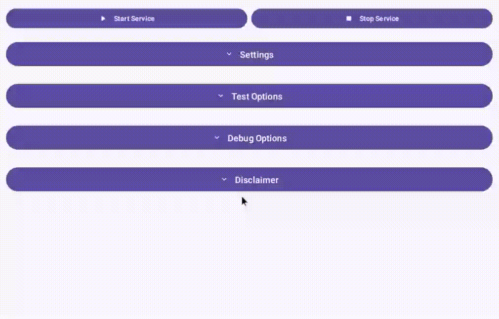
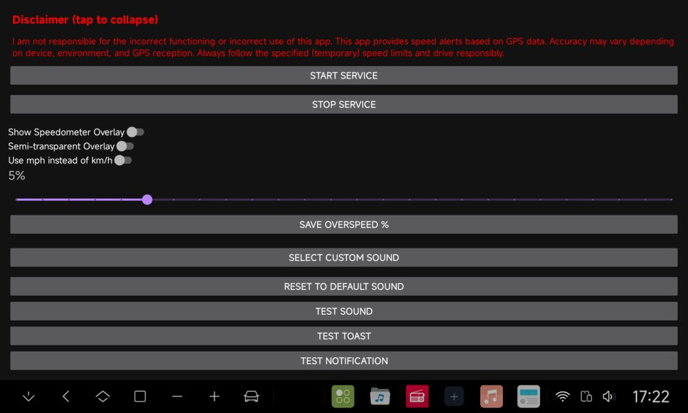
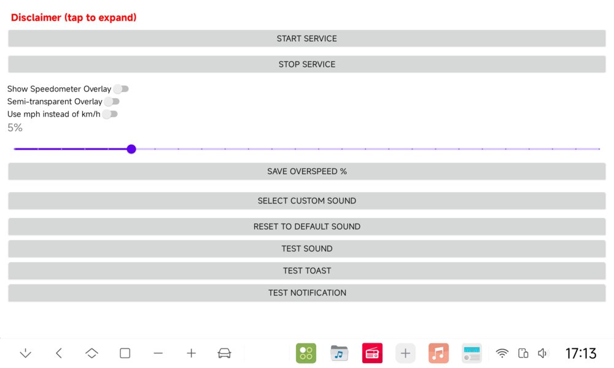
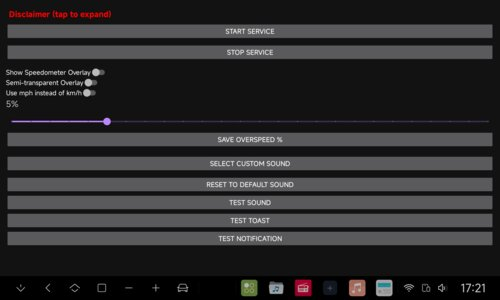
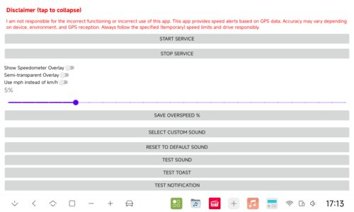

# Speed Alert
<br>
<!--  -->
A simple tool that plays a (user selectable) alarm sound and shows both a toast and pushes a notification when you exceed speed limits.<br>
This app uses your GPS to get exact location and speed and then uses the [Overpass Api](https://wiki.openstreetmap.org/wiki/Overpass_API) from the [OpenStreetMap](https://openstreetmap.org) database to get speed limits for the relevant part of the road you are driving on. Note that this app will only work if the GPS location is accurate and the road has assigned speed limits in the [OpenStreetMap](https://openstreetmap.org) database.<br>
This app is 80% made with AI (MS CoPilot) and 20% by "me, myself and I".
### Note: You use this app entirely at your own risk. I am not responsible for incorrect functioning or incorrect use of the app. All responsibility for use, or incorrect use, lies entirely with you! Always follow the specified (temporary) speed limits and drive responsibly.

## App Permissions
\- It needs ACCESS_FINE_LOCATION to get access to your exact location (during use of the App). Otherwise it can't check your location and if you are overspeeding or not.<br>
\- It needs POST_NOTIFICATIONS to be able to push notifications and toasts to your screen.<br>
\- Needs ACTION_MANAGE_OVERLAY_PERMISSION when using an overlay.<br>
\- Request IGNORE_BATTERY_OPTIMIZATIONS. This as Android might kill long-running apps not really in the foreground.<br>
**This app does not collect, store or share any personal information. It is 100% privacy friendly.**

## Screenshots
*(Note: The screen automatically follows the system day-night mode. Here you see two examples.)*<br>
<br>
<!-- **Dark mode, disclaimer expanded**<br>
<br>
**Day mode, disclaimer collapsed**<br>
<br> -->

<!--
 Collapsed Disclaimer    | Expanded Disclaimer  
:------------------------|---------------------:
 | 
 |  -->

<p>The app uses a "foreground service". A foreground service is an Android service that keeps running by showing a persistent notification so the system treats it as important and doesn’t kill it, even when not visible.<br>
The speed alert service is started automatically. However, you can stop and (re)start it, which you need to do when changing (some of) the settings.<br>
It can show an overlay, which you can drag anywhere on the screen and that location will be remembered.<br>
Again: Note that this apk will only work if the GPS location is accurate and the road has assigned speed limits in the [OpenStreetMap](https://openstreetmap.org) database.</p>
Buttons that might need an explanation:
<ul><li> Alarm slider (0 - 25%), current percentage value (above it) and "Save Overspeed %" button: By default the app uses 5% (at 100 km/h road speed limit, that means it warns at 105 km/h).
<li> Select Alarm Sound - By default it uses a default builtin "beep-beep-beep". If you want to select something else, you can do that here.</li>
<li> Reset to Default Sound - In case you get tired of your own selected sound, you can return to the beautiful "beep-beep-beep".</li>
<li> Start and Stop - Explained above.</li>
</ul>


## Installation
Just download it from [Github](https://github.com/hvdwolf/SpeedAlert/releases/latest) and then side-load the application from your file manager.<br>(Note: When Google asks you to scan the app, then do so. My app is signed and should be OK, but we live in dangerous times).<br>

## Releases
The releases are done via [my github](https://github.com/hvdwolf/SpeedAlert/releases/latest).<br>
The app should run on Android 8.1 to 14, but I only tested on my DuDu7 running Android 13/SDK33.<br>
*(Technically it should also run on mtcd/mtce type units, all fyt units and TS10/TS18 units)*

## Translations
I used MS CoPilot to do an automatic translation of the strings. The default language is (US) English. Other abbreviated languages are (so far): us, da, de, es, fr, it, nl, pl, pt, ru, uk, vi.<br>
If you want to have it in your own language, you need to download the [strings.xml](https://github.com/hvdwolf/SpeedAlert/raw/main/app/src/main/res/values/strings.xml), translate it (note the multi-line disclaimer) and send it back to me. A good advice might be to select and copy the entire text and tell chatgpt, ms copilot, gemini or whatever AI tool to "translate the following strings.xml to \<language\>:"  and then copy the text behibd it. It saves you a lot of typing. Only some correcting if necessary.<br>
If you think your language is badly translated, download the strings.xml from your country folder [values-xx](https://github.com/hvdwolf/SpeedAlert/raw/main/app/src/main/res/) and improve the translation. _(I think it did a pretty nice job for my own Dutch language)_
<HR>


Copyleft 2026 Harry van der Wolf (surfer63), MIT License.<br>

## MIT License
Permission is hereby granted, free of charge, to any person obtaining a copy
of this software and associated documentation files (the "Software"), to deal
in the Software without restriction, including without limitation the rights
to use, copy, modify, merge, publish, distribute, sublicense, and/or sell
copies of the Software, and to permit persons to whom the Software is
furnished to do so, subject to the following conditions:

The above copyright notice and this permission notice shall be included in all
copies or substantial portions of the Software.

THE SOFTWARE IS PROVIDED "AS IS", WITHOUT WARRANTY OF ANY KIND, EXPRESS OR
IMPLIED, INCLUDING BUT NOT LIMITED TO THE WARRANTIES OF MERCHANTABILITY,
FITNESS FOR A PARTICULAR PURPOSE AND NONINFRINGEMENT. IN NO EVENT SHALL THE
AUTHORS OR COPYRIGHT HOLDERS BE LIABLE FOR ANY CLAIM, DAMAGES OR OTHER
LIABILITY, WHETHER IN AN ACTION OF CONTRACT, TORT OR OTHERWISE, ARISING FROM,
OUT OF OR IN CONNECTION WITH THE SOFTWARE OR THE USE OR OTHER DEALINGS IN THE
SOFTWARE.
```
