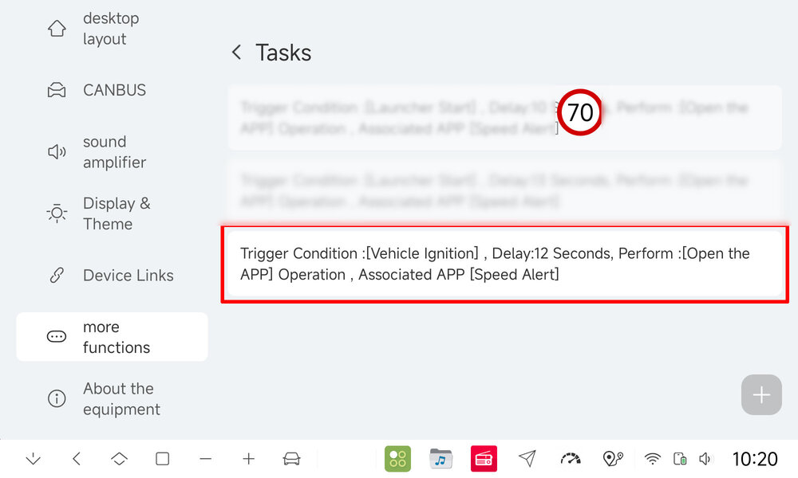

# How to autostart SpeedAlert on your DuDu

The Android under Dudu7 does not directly allow you to start an app at "boot complete", unless it is a system signed app. That is not possible for non-FYT/non-Dudu apps on the newer DuDu versions. 
However, DuDu itself lets you create tasks to "do things". You can start an app when you start your car. 

- Settings 
- More Functions 
- Tasks:
    * Trigger: Vehicle ignition
    * Delay: 5 - 15 seconds
    * Open the app - Speed Alert

